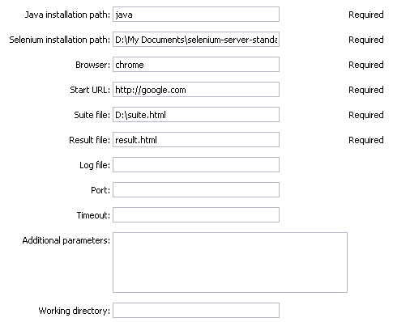
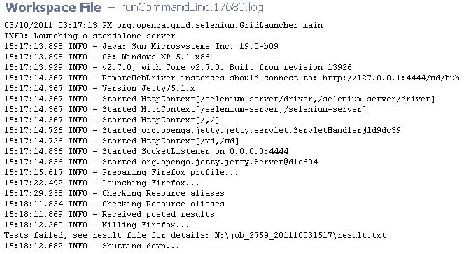
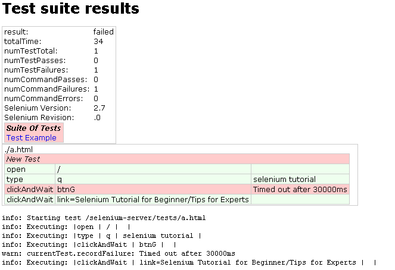

# Integrated version

This plugin was developed and tested against Selenium Remote Control
version 1.0.3.

# Plugin procedures

For all parameter descriptions below, required parameters are shown in
bold italics.

## Run Selenium

Parameters `Browser`, `Start URL`, `Suite File` and `Result File` make
use of the command-line option `-htmlSuite` this been defined in one
simple line, separating the parameters by spaces. This is the reason why
they all have specified in the table below that make use of the
`htmlSuite` command-line option

<table>
<colgroup>
<col style="width: 50%" />
<col style="width: 50%" />
</colgroup>
<thead>
<tr class="header">
<th style="text-align: left;">Parameter</th>
<th style="text-align: left;">Description</th>
</tr>
</thead>
<tbody>
<tr class="odd">
<td style="text-align: left;">
Java installation path
</td>
<td style="text-align: left;">
Provide the path where <code>java.exe</code> is
installed. Default value is <code>java</code>, which assumes it is loaded in the
system path. (Required)
</td>
</tr>
<tr class="even">
<td style="text-align: left;">
Selenium installation path
</td>
<td style="text-align: left;">
Provide the path where Selenium is
installed. If no value is provided <code>selenium-server.jar</code> is
used.(Required)
</td>
</tr>
<tr class="odd">
<td style="text-align: left;">
Browser
</td>
<td style="text-align: left;">
Indicate the web browser to use.(This
is the command-line <code>-htmlSuite</code> option)(Required)
</td>
</tr>
<tr class="even">
<td style="text-align: left;">
Start URL
</td>
<td style="text-align: left;">
Provide the URL to apply the tests
to.(This is the command-line <code>-htmlSuite</code> option)(Required)
</td>
</tr>
<tr class="odd">
<td style="text-align: left;">
Suite file
</td>
<td style="text-align: left;">
Provide the absolute path to the file
that contains the suite tests.(This is the command-line <code>-htmlSuite</code>
option)(Required)
</td>
</tr>
<tr class="even">
<td style="text-align: left;">
Result file
</td>
<td style="text-align: left;">
Name the file where results will be
saved. Do not indicate a path for the <code>resultfile</code>. The results can be found in the  
<b>Selenium Test Results</b> link on the <b>Links</b> section of the <b>Job
Details</b>.(This is the command-line <code>-htmlSuite</code>
option)(Required)
</td>
</tr>
<tr class="odd">
<td style="text-align: left;">
Log file
</td>
<td style="text-align: left;">
Provide a name for the log file. (This
is the command-line <code>-log</code> option)
</td>
</tr>
<tr class="even">
<td style="text-align: left;">
Port
</td>
<td style="text-align: left;">
Indicate the port to use, default is
<code>4444</code>. (This is the command-line <code>-port</code>> option)
</td>
</tr>
<tr class="odd">
<td style="text-align: left;">
Timeout
</td>
<td style="text-align: left;">
Indicate the number of seconds before
giving up on a process. (This is the command-line <code>-timeout</code>
option)
</td>
</tr>
<tr class="even">
<td style="text-align: left;">
Additional parameters
</td>
<td style="text-align: left;">
Provide any additional commands for
Selenium, written as if they were typed in the console.
</td>
</tr>
<tr class="odd">
<td style="text-align: left;">
Working Directory
</td>
<td style="text-align: left;">
Indicate the desired working directory.
Leave blank to use the default workspace.
</td>
</tr>
</tbody>
</table>

### Parameter form

### Log file

### HTML output report

# Release notes

## EC-Selenium 2.0.9

-   The documentation has been migrated to the main site.

## EC-Selenium 2.0.8

- Renaming to "CloudBees CD/RO".

## EC-Selenium 2.0.7

-   Renaming to "CloudBees"

## EC-Selenium 2.0.5

-   Renamed ElectricCommander to ElectricFlow.

## EC-Selenium 2.0.4

-   Procedure name(s) were changed in the step picker section

## EC-Selenium 2.0.3

-   Fixed workspace issue.

## EC-Selenium 2.0.2

-   Improves to the help page document.

## EC-Selenium 2.0.1

-   New XML panel parameters implementation.

-   New help page format.
